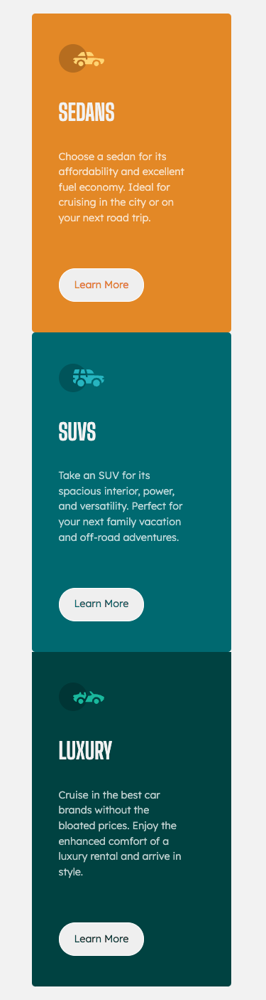

# Frontend Mentor - 3-column preview card component


This is a solution to the [3-column preview card component challenge on Frontend Mentor](https://www.frontendmentor.io/challenges/3column-preview-card-component-pH92eAR2-).


## Table of contents

- [Overview](#overview)
  - [The challenge](#the-challenge)
  - [Screenshot](#screenshot)
- [My process](#my-process)
  - [Built with](#built-with)
  - [What I learned](#what-i-learned)
- [Author](#author)


## Overview

### The challenge

Users should be able to:

- View the optimal layout depending on their device's screen size
- See hover states for interactive elements

### Screenshot

#### Desktop


#### Mobile



## My process


### Built with
- Semantic HTML5 markup
- CSS custom properties
- Flexbox


### What I learned
I have learned more about flexbox and how to use it.


```html
<h1>Some HTML code I'm proud of</h1>

<div class="car-type">
    <div class="car-type--sedan">
        
        <h1 class="car-header">Sedans</h1>
        <p class="car-description">Choose a sedan for its affordability and excellent fuel economy. Ideal for cruising in the city or on your next road trip.</p>
    <button class="car-button">Learn More</button>
</div>

```

```css
.proud-of-this-css {}

@media only screen and (max-width: 375px){
    .car-type {
        flex-direction: column;
        overflow: auto;
    }
    .car-type--sedan, .car-type--suv, .car-type--luxury {
        width: 75%;
        margin: 0 5% 0 12%;
        padding-left: 10%;
    }
}

```

## Author

- Linkedin - [Tamara Carlos](https://www.linkedin.com/in/tamaracarlos/)
- Frontend Mentor - [@aramatsolrac](https://www.frontendmentor.io/profile/aramatsolrac)
- Twitter - [@aramatsolrac](https://twitter.com/aramatsolrac)


