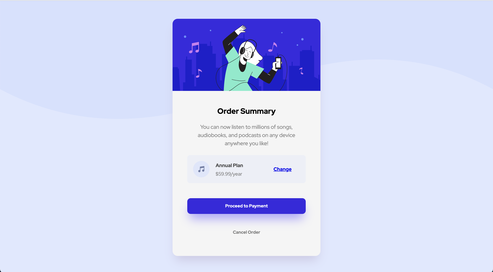

# Frontend Mentor - Order summary card solution

This is a solution to the [Order summary card challenge on Frontend Mentor](https://www.frontendmentor.io/challenges/order-summary-component-QlPmajDUj). Frontend Mentor challenges help you improve your coding skills by building realistic projects.

## Table of contents

- [Overview](#overview)
  - [The challenge](#the-challenge)
  - [Screenshot](#screenshot)
- [My process](#my-process)
  - [Built with](#built-with)
  - [What I learned](#what-i-learned)
- [Author](#author)


## Overview

### The challenge

Users should be able to:

- See hover states for interactive elements

### Screenshot




## My process


### Built with

- Semantic HTML5 markup
- CSS custom properties
- Flexbox

### What I learned

I have learned how to organize better HTML and CSS code, which is a skill I want to improve. Besides that, I have learned how to make border-radius, hover, and box-shadow related to CSS. I have also been learning more about the box model, which I struggled to apply in this challenge.

```html
<h1>Some HTML code I'm proud of</h1>
<div class="annual_plan">
    <span class="img_icon_music">
        
    </span>
    <div>
        <p class="annual_plan_name">Annual Plan</p>
        <p class="annual_plan_price">$59.99/year</p>
    </div>
    <a href="#" class="annual_plan_change">Change</a>
</div>

```
```css
.proud-of-this-css {}

.payment .button_payment {
    font-size: 13px;
    font-weight: 700;
    text-decoration: none;
    width: 320px;
    padding: 4%;
    box-shadow: 0px 20px 30px -8px hsl(245, 96%, 79%);
    background-color: hsl(245, 75%, 52%);
    color: white;
    border: none;
    border-radius: 10px 10px 10px 10px;
    cursor: pointer;
    transition: 0.3s;
}
```

## Author

- Linkedin - [Tamara Carlos](https://www.linkedin.com/in/tamaracarlos/)
- Frontend Mentor - [@aramatsolrac](https://www.frontendmentor.io/profile/aramatsolrac)
- Twitter - [@aramatsolrac](https://twitter.com/aramatsolrac)

