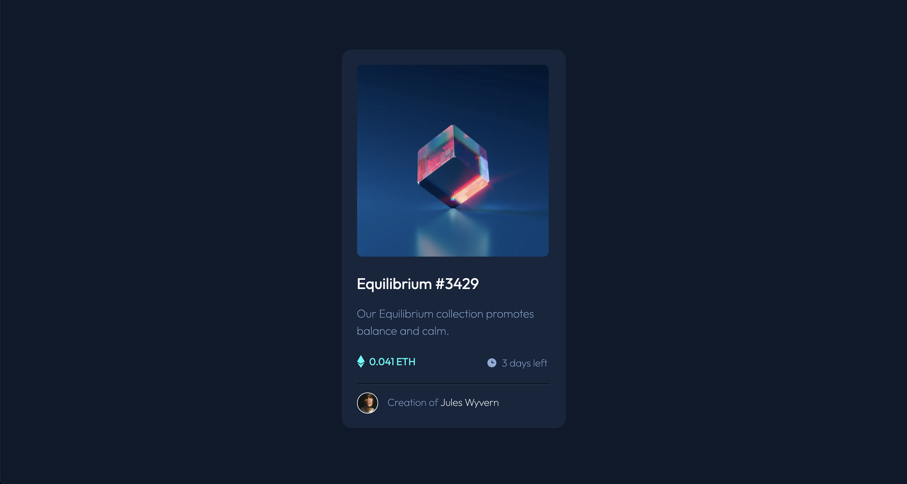
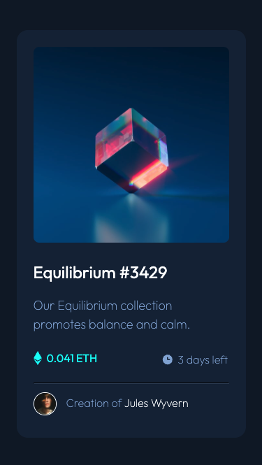

# Frontend Mentor - NFT preview card component

This is a solution to the [NFT preview card component challenge on Frontend Mentor](https://www.frontendmentor.io/challenges/nft-preview-card-component-SbdUL_w0U). Frontend Mentor challenges help you improve your coding skills by building realistic projects.


## Table of contents

- [Overview](#overview)
  - [The challenge](#the-challenge)
  - [Screenshot](#screenshot)
- [My process](#my-process)
  - [Built with](#built-with)
  - [What I learned](#what-i-learned)
- [Author](#author)


## Overview

### The challenge

Users should be able to:

- View the optimal layout depending on their device's screen size
- See hover states for interactive elements

### Screenshot

#### Desktop


#### Mobile



## My process


### Built with
- Semantic HTML5 markup
- CSS custom properties
- Flexbox


### What I learned
I have learned more about media queries. Besides that, I realized that I have struggled to name my CSS classes; therefore, I want to read more about CSS names conventions to improve them in my next challenges.


```html
<h1>Some HTML code I'm proud of</h1>

<div class="div-details">
  <div class="div-details--eth">
    
    <span class="div-details--eth-number">0.041 ETH</span>
  </div>
  <div class="div-details--time">
    
    <span class="div-details--time-days">3 days left</span>
  </div>
</div>

```

```css
.proud-of-this-css {}

@media only screen and (max-width: 375px) {
  .d-equilibrium p {
    max-width: 90%;
  }

  .image-equilibrium img {
    max-width: 17.5rem;
    max-height: 17.5rem;
  }

  footer {
    font-size: 0.85rem;
  }
}

```

## Author

- Linkedin - [Tamara Carlos](https://www.linkedin.com/in/tamaracarlos/)
- Frontend Mentor - [@aramatsolrac](https://www.frontendmentor.io/profile/aramatsolrac)
- Twitter - [@aramatsolrac](https://twitter.com/aramatsolrac)
